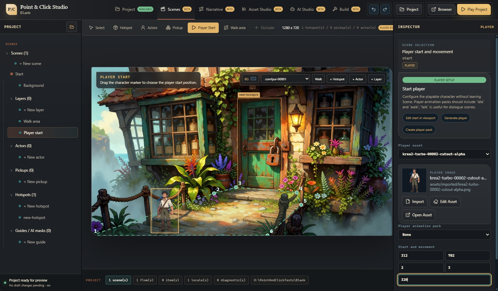

# Point & Click Engine

Open-source TypeScript engine and editor for building 2D point-and-click
adventures with Git-friendly project files, deterministic runtime state, and
local-first AI asset workflows. Creator Alpha `v0.4.0-alpha.1` is a
Windows-first distribution and accessibility alpha. Static web export is
available; a hosted web demo and published SDK are not part of this candidate.



## Creator Alpha Screenshots

The public Creator Alpha path is visible in three focused surfaces:

- **Player:** [complete deterministic sample loop](docs/assets/player.jpg)
- **AI Studio:** [Advanced open with Candidate Output reachable](docs/assets/ai-studio-advanced.png)
- **Asset Studio:** [mock asset inspection and cleanup workspace](docs/assets/asset_studio.jpg)
- **Test Lab:** [embedded runtime and logical-state comparison](docs/assets/test-lab.png)

Release page: [GitHub `v0.4.0-alpha.1`](https://github.com/danieleforte92/PointAndClickEngine/releases/tag/v0.4.0-alpha.1)
for the Windows x64 package, Squirrel installer, checksums, release evidence,
and source archive.

## What You Can Try Today

- Open the Electron editor and create, open, or start from a starter project.
- Edit layered 2D scenes, hotspots, pickups, actors, player start, and walk areas.
- Author and diagnose narrative graphs with ten node families, typed connections,
  deterministic auto-layout, pan/zoom, minimap, and persisted editor positions.
- Browse project content through Resources, including scenes, image and audio
  assets, animation packs, flows, locales, items, prompt packs, style bibles,
  workflows, and recipes.
- Import or drop image and audio assets, inspect their usages, and assign them to
  scenes, actors, pickups, the player, or sound cues.
- Use Asset Studio as the canonical place for asset info, non-destructive chroma
  cleanup, crop, optimization, generation guides, and animation packs.
- Configure player asset, animation pack, scale-by-depth, and walk speed.
- Run the current project in Test Lab, inspect runtime state, and replay the same
  logical actions in a browser to find the first state divergence.
- Test waypoint movement, pending interactions, save slots, autosave, and
  browser/Electron persistence in the runtime.
- Migrate a v1 project with `pointclick migrate`, including dry-run and backup
  mode, then inspect Flow graph diagnostics and puzzle dependencies.
- Export a project as a static web build and open the generated output locally.
- Exercise keyboard focus, captions, reduced motion, and narrow browser layouts
  in the player.
- Generate prompt packs with the deterministic mock provider, LM Studio, or an
  experimental opt-in cloud provider.
- Ask the local deterministic copilot for reviewable narrative and puzzle beats;
  it never changes runtime behavior or project files by itself.
- Generate temporary image candidates in batches, review warnings and provenance,
  then explicitly apply a selected candidate to the project.
- Validate project documents from the CLI and CI.

The current public sample is **The Isle of Echoes**, a compact two-scene
adventure that demonstrates walking, hotspots, inventory, item use, dialogue,
scene transition, prompt-pack provenance, and MVP spritesheet animation.

## Why This Exists

Classic adventure tools often hide too much state inside editor binaries.
Point & Click Engine keeps game content in readable JSON documents, runs gameplay
through deterministic commands and events, and treats the editor as a visual
authoring layer over the same contracts used by the player.

That makes projects easier to diff, validate, test, review, and eventually
extend with custom tooling.

## Requirements

- Node.js 22.17.0 (the CI and release toolchain version).
- pnpm 9.6.0, via Corepack.
- Windows is the primary Creator Alpha packaging target.

Optional local AI tools:

- LM Studio for local prompt-pack drafting.
- ComfyUI for local image generation and transparent/chroma asset workflows.

## Quick Start

```powershell
corepack enable
pnpm install --frozen-lockfile
pnpm dev
```

`pnpm dev` starts:

- the web player at `http://127.0.0.1:5173`;
- the Electron editor.

In the editor, start with one of these paths:

1. **Create Blank Project** for a clean new project.
2. **Create From Starter** for a minimal editable project.
3. **Open Project** and choose `apps/sample-game/project` to inspect the sample.

Use **Play** to enter an isolated Test Lab session. From Test Lab, choose
**Browser** to replay the recorded logical actions in your system browser and
compare both runtime traces.

## Try This First

1. Open `apps/sample-game/project`.
2. In **Scene**, move a hotspot, pickup, player start, or walk-area point.
3. In **Player**, choose the player asset or animation pack and adjust walk speed.
4. In **Narrative**, open a flow, edit its graph, and run diagnostics.
5. In **AI**, generate a mock prompt pack or a small candidate batch. Apply one
   approved candidate; it remains temporary until that action.
6. If ComfyUI is running, install a workflow preset, save a generation recipe,
   and generate/import one image asset.
7. Drop or import an image in an inspector, then try **Remove Background** on a
   flat chroma output.
8. Choose **Play**, complete part of the dock-to-tavern loop in Test Lab, then
   open **Browser**, refresh telemetry, and inspect **Compare**.
9. Open **Build**, resolve validation or dirty-draft blockers, and export a
   static web build to an empty folder.

## AI Is Local-First And Reviewable

Creator Alpha does not require paid provider keys.

- **Mock deterministic** works offline and is the default open-source path.
- **LM Studio local** can draft prompt packs through a local OpenAI-compatible
  server.
- **ComfyUI local** can generate image assets from installed 8GB-oriented
  workflow presets and reviewable recipes. Legacy exported API workflows remain
  available for advanced users.
- **Free target prompts** let creators generate a selected scene background,
  layer, player, hotspot, pickup, or actor directly from Scene with a shared art
  style preset and chroma/alpha output contract, without drafting a full prompt
  pack first.
- **OpenAI image** and **Google image** providers are experimental opt-in paths for
  text-to-image generation. API keys, access tokens, cloud project ids, base
  URLs, and model choices stay in the editor session and are not written to
  project JSON.
- **OpenAI prompt packs** are optional and require an API platform key; ChatGPT
  subscriptions do not replace API billing.

AI output is treated as draft authoring material. Prompt packs are saved only
after approval. Generated images first live in a session-only candidate store;
only **Apply to Project** writes the selected candidate as a normal asset, and
assignment is a separate authoring action. Discarded candidates never enter the
project. Generated image assets record provider id, provider
job id, prompt, seed, model, workflow id, recipe id, workflow family,
references, masks, parent asset lineage, warnings, latency/cost when available,
and prompt pack target links when available.

## Verify

```powershell
pnpm check
```

The release gate runs unit tests, typecheck, sample validation, starter
validation, package builds, release hygiene, and development-mode provenance
coverage. A separate strict provenance gate intentionally blocks public
redistribution until every review-required item has a recorded rights decision.
CI also blocks high and critical dependency advisories across runtime and
packaging dependencies.

Useful focused commands:

```powershell
pnpm test
pnpm test -- --coverage
pnpm test:e2e
pnpm test:e2e:packaged
pnpm validate:sample
pnpm validate:starter
pnpm validate:provenance
pnpm validate:provenance:strict
pnpm build
pnpm verify:windows-package
pnpm --filter @pointclick/editor make
```

The packaged Windows editor is written to:

```text
apps/editor/out/PointClickStudio-win32-x64/
```

Packaged preview embeds the player bundle and serves it from an ephemeral
loopback HTTP server, so preview does not require a development server.

## Repository Tour

```text
apps/editor            Electron/React authoring shell
apps/player-web        Web player and preview target
apps/sample-game       Public sample adventure project
apps/starter-game      Minimal clean starter project
packages/contracts     JSON Schema-compatible public documents
packages/core          Deterministic commands, events, state, and RNG
packages/flows         Narrative flow execution
packages/runtime       Renderer-independent adventure orchestration
packages/renderer-2d   PixiJS layered scene renderer
packages/audio         Runtime audio-cue resolution
packages/cli           Project validation commands
```

## Current Limitations

- Creator Alpha focuses on 2D layered scenes; hybrid 3D is schema-planned only.
- Narrative graphs cover the built-in node families; custom node plugins and
  free-form third-party graph extensions are not part of Creator Alpha.
- Character Gym has an MVP editor workflow for spritesheet slicing, clip
  preview, pack editing, and player/actor assignment; generated animation-sheet
  consistency still needs stronger presets.
- Transparent PNG generation depends on the selected ComfyUI workflow or
  in-editor chroma cleanup from a flat blue/green background.
- Reference and mask inputs require a project-relative custom ComfyUI workflow
  API JSON with compatible image loader nodes; the built-in text-to-image path
  intentionally ignores image inputs.
- Hosted web demo and marketing site are not required for the first public
  release.
- Hosted web demo, marketing site, SDK publishing, and a full autonomous
  puzzle-AI system are outside Creator Alpha. Static web export is available.
  Cloud AI providers are experimental, optional, and must never be required to
  use the editor.

## Docs

- [Roadmap](docs/roadmap.md)
- [Architecture](docs/architecture.md)
- [Project Format](docs/project-format.md)
- [Git Project History Guide](docs/git-project-history.md)
- [Authoring Tutorial](docs/authoring-tutorial.md)
- [Studio Workflows](docs/studio-workflows.md)
- [AI Prompt Pack Guide](docs/ai-prompt-pack-guide.md)
- [Character Gym Guide](docs/character-gym-guide.md)
- [Sample Demo Checklist](docs/sample-demo-checklist.md)
- [Release Checklist](docs/release-checklist.md)
- [Creator Alpha Support and Version Policy](docs/creator-alpha-policy.md)
- [Provenance Inventory](provenance/inventory.json)
- [Third-Party and Asset Notices](THIRD_PARTY_NOTICES.md)
- [Creator Alpha Release Issue Draft](docs/creator-alpha-release-issue.md)
- [Troubleshooting](docs/troubleshooting.md)
