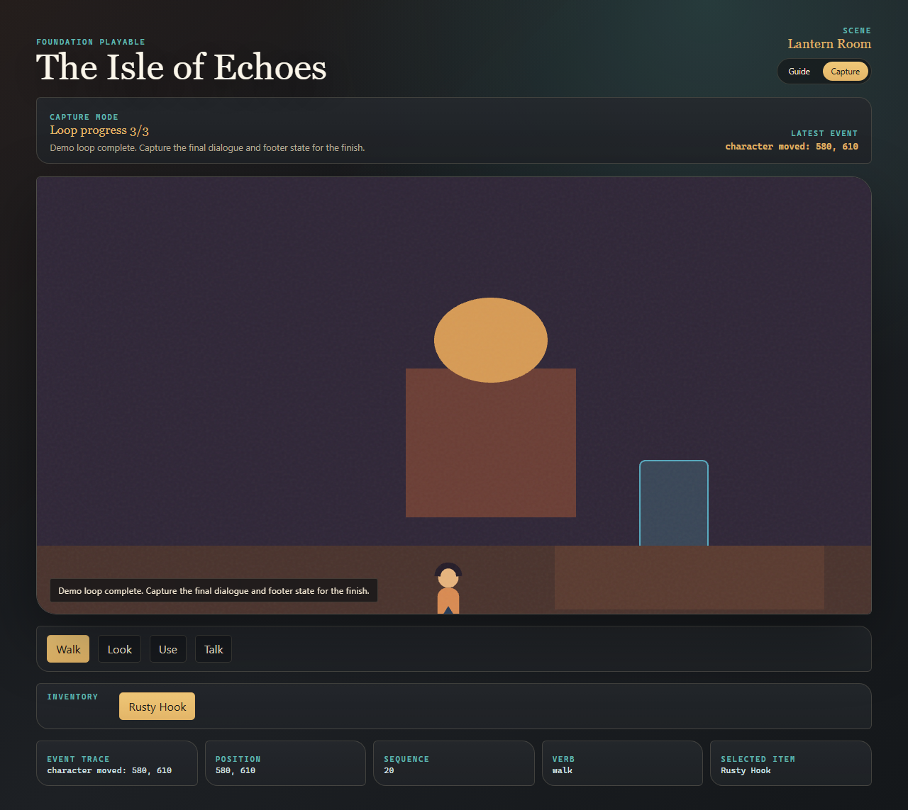

# Point & Click Engine

Open-source TypeScript engine and editor for building 2D point-and-click
adventures with Git-friendly project files, deterministic runtime state, and
local-first AI asset workflows.



## What You Can Try Today

- Open the Electron editor and create, open, or start from a starter project.
- Edit layered 2D scenes, hotspots, pickups, actors, player start, and walk areas.
- Author linear dialogue and scene-transition flows.
- Import or drop image assets and assign them to scenes, actors, pickups, or the player.
- Use Asset Studio as the canonical place for asset info, chroma cleanup, crop,
  generation guides, and animation packs.
- Configure player asset, animation pack, scale-by-depth, and walk speed.
- Run the sample adventure in the web player or editor preview.
- Generate prompt packs with the deterministic mock provider, LM Studio, or OpenAI.
- Generate and import image assets from a local ComfyUI API workflow.
- Validate project documents from the CLI and CI.

The current public sample is **The Isle of Echoes**, a compact two-scene
adventure that demonstrates walking, hotspots, inventory, item use, dialogue,
scene transition, prompt-pack provenance, and MVP spritesheet animation.

## Why This Exists

Classic adventure tools often hide too much state inside editor binaries.
Point & Click Engine keeps game content in readable JSON documents, runs gameplay
through deterministic commands and events, and treats the editor as a visual
authoring layer over the same contracts used by the player.

That makes projects easier to diff, validate, test, review, and eventually
extend with custom tooling.

## Requirements

- Node.js 22.17 or newer. Node.js 24 LTS is recommended.
- pnpm 9.6.
- Windows is the primary Creator Alpha packaging target.

Optional local AI tools:

- LM Studio for local prompt-pack drafting.
- ComfyUI for local image generation and transparent/chroma asset workflows.

## Quick Start

```powershell
pnpm install --force
pnpm dev
```

`pnpm dev` starts:

- the web player at `http://127.0.0.1:5173`;
- the Electron editor.

In the editor, start with one of these paths:

1. **Create Blank Project** for a clean new project.
2. **Create From Starter** for a minimal editable project.
3. **Open Project** and choose `apps/sample-game/project` to inspect the sample.

Use **Play from here** for the isolated Electron preview or **Browser** to open
the player in your system browser.

## Try This First

1. Open `apps/sample-game/project`.
2. In **Scene**, move a hotspot, pickup, player start, or walk-area point.
3. In **Player**, choose the player asset or animation pack and adjust walk speed.
4. In **AI**, generate a mock prompt pack, then review the background, prop,
   character, and animation prompts.
5. If ComfyUI is running, install a workflow preset, save a generation recipe,
   and generate/import one image asset.
6. Drop or import an image in an inspector, then try **Remove Background** on a
   flat chroma output.
7. Open **Build** and run validation.
8. Preview the sample and play the dock-to-tavern loop.

## AI Is Local-First And Reviewable

Creator Alpha does not require paid provider keys.

- **Mock deterministic** works offline and is the default open-source path.
- **LM Studio local** can draft prompt packs through a local OpenAI-compatible
  server.
- **ComfyUI local** can generate image assets from installed 8GB-oriented
  workflow presets and reviewable recipes. Legacy exported API workflows remain
  available for advanced users.
- **OpenAI** is optional and requires an API platform key; ChatGPT subscriptions
  do not replace API billing.

AI output is treated as draft authoring material. Prompt packs are saved only
after approval, image generation imports normal asset documents, and provider
provenance stays visible. Generated image assets record prompt, seed, model,
workflow id, recipe id, workflow family, references, masks, parent asset
lineage, warnings, and prompt pack target links when available.

## Verify

```powershell
pnpm check
```

The release gate runs unit tests, typecheck, sample validation, starter
validation, and package builds.

Useful focused commands:

```powershell
pnpm test
pnpm test:e2e
pnpm validate:sample
pnpm validate:starter
pnpm build
```

The packaged Windows editor is written to:

```text
apps/editor/out/PointClickStudio-win32-x64/
```

Packaged preview embeds the player bundle and serves it from an ephemeral
loopback HTTP server, so preview does not require a development server.

## Repository Tour

```text
apps/editor            Electron/React authoring shell
apps/player-web        Web player and preview target
apps/sample-game       Public sample adventure project
apps/starter-game      Minimal clean starter project
packages/contracts     JSON Schema-compatible public documents
packages/core          Deterministic commands, events, state, and RNG
packages/flows         Narrative flow execution
packages/runtime       Renderer-independent adventure orchestration
packages/renderer-2d   PixiJS layered scene renderer
packages/cli           Project validation commands
```

## Current Limitations

- Creator Alpha focuses on 2D layered scenes; hybrid 3D is schema-planned only.
- Flow authoring is structured but not a full graph editor yet.
- Character Gym has runtime and document support, but the full sprite editor UX
  is still being completed.
- Transparent PNG generation depends on the selected ComfyUI workflow or
  in-editor chroma cleanup from a flat blue/green background.
- Reference and mask inputs require a project-relative custom ComfyUI workflow
  API JSON with compatible image loader nodes; the built-in text-to-image path
  intentionally ignores image inputs.
- Hosted web demo and marketing site are not required for the first public
  release.

## Docs

- [Roadmap](docs/roadmap.md)
- [Architecture](docs/architecture.md)
- [Project Format](docs/project-format.md)
- [Authoring Tutorial](docs/authoring-tutorial.md)
- [AI Prompt Pack Guide](docs/ai-prompt-pack-guide.md)
- [Character Gym Guide](docs/character-gym-guide.md)
- [Sample Demo Checklist](docs/sample-demo-checklist.md)
- [Release Checklist](docs/release-checklist.md)
- [Creator Alpha Release Issue Draft](docs/creator-alpha-release-issue.md)
- [Troubleshooting](docs/troubleshooting.md)
