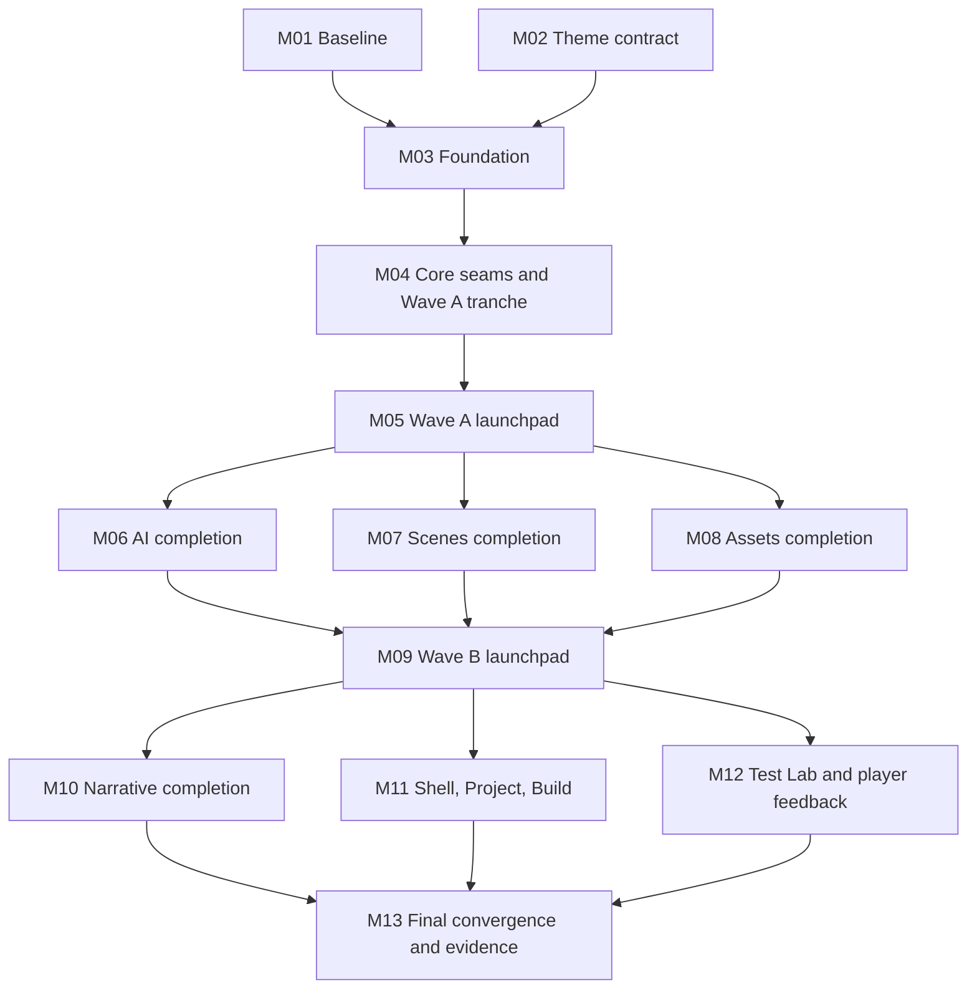

# Editor Modularization and Visual Convergence Delivery Goal

## Goal record

| Field | Value |
|---|---|
| Goal ID | `EMVC-BETA-1` |
| Status | Complete |
| Target release | Ready for inclusion in `v0.4.0-beta.1` |
| Accountable owner | Editor integrator |
| Integration branch | `develop` |
| Historical baseline | `develop` at `6a1d2ec` on 2026-07-14 |
| Last verified checkpoint | `develop` terminal integration commit on 2026-07-15 |
| Current score | **100/100 points (100%)** |
| Next action | Beta release process (outside this goal) |
| Completion record | 2026-07-15; the same terminal integration commit recorded on `develop` |

## Measurable objective

Before the `v0.4.0-beta.1` candidate is cut, turn the editor into a modular,
reviewable application with a single scoped visual language while preserving
project and gameplay behavior.

The goal is complete only when all of the following are true on the same
`develop` commit:

1. Milestones M01-M13 are verified and the score is **100/100**.
2. Every terminal metric in the scorecard meets its target.
3. The terminal quality gate passes and its evidence is recorded in this file.
4. The completion commit is reachable from `develop` through reviewed pull
   requests.

Publishing the beta is outside this goal. This goal produces an editor that is
ready to enter the beta release process.

## Scope boundaries

### Required outcomes

- `EditorApp` is a composition root and workspace router, not a feature
  implementation.
- Project session, navigation, preview, commands, and feature-local state have
  explicit typed boundaries and testable pure logic.
- Project, Scenes, Narrative, Assets, AI, Build, and Test Lab each own their
  view, controller or reducer, styles, and focused tests.
- Presentation components do not call `EditorGateway` directly.
- Sibling features communicate only through shared typed navigation and
  handoff contracts.
- Editor chrome uses one scoped semantic theme. Player changes occur only in
  the separately reviewed runtime-feedback milestone.
- Current project, authoring, preview, Test Lab, and player behavior remains
  green throughout the refactor.

### Non-goals

- Project schema or gameplay contract changes.
- New AI providers or generation workflows.
- Replacing the existing navigation target or injectable gateway seams.
- Adopting a global state library before the planned controllers, reducers,
  and context boundaries have been evaluated.
- Rebuilding the player layout or changing gameplay behavior.
- Publishing `v0.4.0-beta.1`.

Any change to these boundaries requires an explicit roadmap revision before
implementation. It does not count as progress toward the current score.

## How progress is measured

### Status definitions

| Status | Meaning | Points earned |
|---|---|---:|
| Not started | No accepted implementation exists | 0 |
| Ready | Dependencies are verified and work may start | 0 |
| In progress | A branch or draft PR exists, but exit criteria are incomplete | 0 |
| Blocked | A named dependency or decision prevents the next exit criterion | 0 |
| Verified | All exit criteria pass on the merged `develop` commit and evidence is recorded | Full milestone points |
| Regressed | Later work invalidated previously recorded evidence | 0 until reverified |

Partial credit is not awarded. The overall percentage is the sum of points for
milestones in `Verified` status. If a later change breaks an exit criterion,
the affected milestone becomes `Regressed` and its points are removed.

### Milestone score

| ID | Deliverable | Depends on | Points | Status | Evidence |
|---|---|---|---:|---|---|
| M01 | Characterization and visual baseline | - | 5 | Verified | Baseline E2E, screenshots, and budget gate in `3490236` |
| M02 | Scoped editor/player theme contract | - | 5 | Verified | Theme entry points and contract gate in `3490236` |
| M03 | Mechanical workspace and stylesheet foundation | M01, M02 | 10 | Verified | Foundation commit `f1cf7f8`, merged in `3490236` |
| M04 | Project/session controllers, command bus, and Wave A structural tranche | M03 | 15 | Verified | PR-20/PR-21 checkpoint at `3490236` |
| M05 | Wave A typed completion launchpad | M04 | 5 | Verified | PR-23 at `47f1564`; CI and CodeQL green |
| M06 | AI feature completion | M05 | 8 | Verified | AI controller, workflow boundary, tests, E2E, and terminal gate on `develop` |
| M07 | Scenes feature completion | M05 | 8 | Verified | Scenes controller, viewport/tree boundary, tests, E2E, and terminal gate on `develop` |
| M08 | Assets feature completion | M05 | 8 | Verified | Assets controller, browser/tool boundary, tests, E2E, and terminal gate on `develop` |
| M09 | Wave B typed boundary launchpad | M06-M08 | 5 | Verified | Typed composition root/router plus Narrative, Project, Build, Shell, and Test Lab boundaries on `develop` |
| M10 | Narrative and graph completion | M09 | 7 | Verified | Feature-owned graph view/controller/style/test, keyboard E2E, screenshot baseline on `develop` |
| M11 | Shell, Project, and Build completion | M09 | 7 | Verified | Shell/Project/Build view/controller/style/test boundaries, typecheck, build and accessibility gates on `develop` |
| M12 | Test Lab and player feedback completion | M09 | 7 | Verified | Feature-owned runtime debug view/controller/style/test, Test Lab/player E2E and package smoke on `develop` |
| M13 | Visual convergence, final budgets, and terminal evidence | M10-M12 | 10 | Verified | Terminal budget, theme, full quality, package, smoke, audit, provenance and screenshot evidence on `develop` |
|  | **Total** |  | **100** | **40 verified** |  |

Current score calculation:

```text
M01 5 + M02 5 + M03 10 + M04 15 + M05 5 + M06 8 + M07 8 + M08 8 + M09 5 + M10 7 + M11 7 + M12 7 + M13 10 = 100/100
```

### Terminal metric scorecard

The current values were measured at checkpoint `47f1564`. M13 must replace
the provisional no-growth budgets in `scripts/check-editor-budget.mjs` with
the terminal targets and extend the check to all relevant editor sources.

| Metric | Current checkpoint | Terminal target | Verification |
|---|---:|---:|---|
| Fully owned feature areas | 0/7 | 7/7 | M06-M08 and M10-M12 exit criteria |
| `ui/editor-app.tsx` physical lines | 13,043 | 300-500 | `pnpm check:editor-budget` |
| `ui/editor.css` physical lines | 3,431 | At most 800, or removed | `pnpm check:editor-budget` |
| `editor-session.ts` physical lines | 1,522 | At most 800 | `pnpm check:editor-budget` |
| Any feature component/controller | Not yet globally enforced | At most 500 normally; none above 800 | `pnpm check:editor-budget` |
| Any feature stylesheet | Not yet globally enforced | At most 800 | `pnpm check:editor-budget` |
| Literal colors in budget-monitored legacy UI files | 458 | Fewer than 12 documented non-theme exceptions per application | `pnpm check:editor-budget` and `pnpm check:theme-contract` |
| Direct gateway calls in presentation components | 0 at checkpoint | 0 | Static audit plus controller tests |
| Imports of sibling feature internals | 0 at checkpoint | 0 | Static audit plus typecheck |
| Critical behavior suites | Green at checkpoint | All green on the completion commit | Full unit and E2E gates |
| Accessibility release thresholds | Partially covered | All thresholds below pass | Automated checks and manual evidence |

“Fully owned” means the area owns all behavior named by its milestone and has
all four of: an exclusive view boundary, a controller or reducer, a feature
stylesheet, and focused automated tests. A partial extraction does not increase
the 0/7 metric.

## Delivery sequence



M06-M08 may run in parallel after M05. M10-M12 may run in parallel only after
M09. M03-M05, M09, and M13 are serial and integrator-owned.

## Verified checkpoint: M01-M05

The following evidence establishes the 40-point starting score for continued
tracking:

- Characterization E2E, deterministic editor baseline screenshots, theme
  contract checks, and editor no-growth budget checks are active.
- `@pointclick/ui-theme` exposes scoped `studio.css`, `player.css`, and
  `theme-contract.css` entry points; the player remains on the legacy palette.
- The editor has ordered reset, shell, theme, feature, and responsive style
  layers. Scene artwork remains intentionally warm and unchanged.
- Pure UI lookup, workspace, authoring, status, project/session, and feature
  operation logic has focused unit coverage.
- Authoring commands, project hydration, recovery, reconciliation, draft
  cleanup, and user-visible error policy use typed controller boundaries.
- AI, Scenes, and Assets have structural feature boundaries and reducers.
  PR-23 supplies typed `model` and `actions` launchpads for completion work.
- `EditorGateway`, navigation targets, `packages/contracts`, and the project
  schema remain unchanged.
- The checkpoint passed 55 Vitest files / 315 tests with 1 skip, 13 Playwright
  tests, workspace typecheck, sample/starter validation, theme, docs, budget,
  build, CI, CodeQL, dependency, and provenance gates.

The checkpoint does not claim feature completion: remaining feature markup and
orchestration in `EditorApp` is explicitly covered by M06-M12.

## Pending milestone contracts

### M06-M08 - Wave A feature completion (24 points)

Each feature branch owns only its feature directory, feature styles, focused
unit tests, and focused E2E spec.

| ID | Branch | Required owned behavior |
|---|---|---|
| M06 | `codex/editor-ai-completion` | Provider dialogs, workflow controller, generation, review, apply, and typed candidate handoff |
| M07 | `codex/editor-scenes-completion` | Inspector, direct manipulation, selection, layers, guides, and viewport controller |
| M08 | `codex/editor-assets-completion` | Asset browser/import, processing, candidate handling, and Character Gym controller |

Each of M06-M08 is verified only when:

1. The listed behavior and orchestration is owned by its feature directory;
   `EditorApp` only wires typed model/action contracts.
2. Presentation components contain no gateway calls and import no sibling
   feature internals.
3. Focused controller/model unit tests and the focused Playwright spec pass.
4. The deterministic workspace screenshots have no unapproved change.
5. Every feature stylesheet is at most 800 lines and uses semantic tokens.
6. `pnpm check` passes, the PR is reviewed and merged to `develop`, and its PR,
   merge commit, command results, and screenshot evidence are recorded here.

These milestones are baseline-neutral. Intentional global visual tuning is
reserved for M13.

### M09 - Wave B typed boundary launchpad (5 points)

M09 is verified only when:

1. Narrative, Shell/Project/Build, and Test Lab/player feedback have explicit
   typed model/action boundaries from the composition root.
2. Shared contracts, root imports, fixtures, manifests, and lockfiles remain
   integrator-owned.
3. No user-visible behavior or unapproved screenshot changes occur.
4. Full editor E2E, `pnpm check`, and the packaged editor build pass on the
   merged `develop` commit.
5. The PR, merge commit, command results, and baseline comparison are recorded
   here.

### M10-M12 - Wave B feature completion (21 points)

| ID | Branch | Required owned behavior | Visual acceptance |
|---|---|---|---|
| M10 | `codex/editor-narrative` | Narrative tree, graph host, nodes, edges, minimap, locale/node inspector, diagnostics | Semantic node families; violet narrative, green endpoints, amber diagnostics |
| M11 | `codex/editor-shell-readiness` | Topbar, workspace tabs, sidebars, status strip, Project, Build, and shell composition | Compact mockup 2-3 density with mockup 4 navy/violet hierarchy |
| M12 | `codex/runtime-feedback-theme` | Test Lab header, tabs, logs, compare, plus player HUD, verbs, inventory, dialogue, and feedback | One runtime/debug language; gameplay and layout behavior unchanged |

Each of M10-M12 is verified only when:

1. The listed area satisfies the four-part “fully owned” definition.
2. Presentation components contain no gateway calls and import no sibling
   feature internals.
3. Focused unit and Playwright tests pass and cover the critical owned flow.
4. Intentional screenshot changes match the visual acceptance column and have
   review evidence; all other screenshot changes are absent.
5. Accessibility thresholds pass for the changed surfaces.
6. File and color budgets pass, `pnpm check` passes, and the reviewed PR is
   merged to `develop` with its evidence recorded here.

### M13 - Final convergence and terminal evidence (10 points)

M13 is verified only when:

1. Every terminal metric in the scorecard meets its target.
2. Compatibility re-exports, dead selectors, duplicate skin layers, and
   superseded theme values are removed.
3. Global tokens, density, elevation, borders, focus, and responsive behavior
   are tuned without introducing feature ownership leaks.
4. The final screenshot matrix is approved and every intentional exception is
   recorded with a rationale.
5. `scripts/check-editor-budget.mjs` enforces the terminal line, ownership, and
   color limits rather than the historical no-growth limits.
6. The terminal quality gate below passes on one `develop` commit.
7. The milestone table, evidence register, goal status, completion date, and
   completion commit are updated in the same PR.

## Quality and evidence contract

### Required gates by change type

| Gate | Every feature PR | M05/M09 launchpad | M13 terminal |
|---|:---:|:---:|:---:|
| Focused unit tests | Required | Required for changed seams | Required |
| Editor typecheck | Required | Required | Required |
| Focused Playwright spec | Required | Required | Required |
| Deterministic screenshots | Required | Required | Required |
| `pnpm test` and `pnpm typecheck` | Required | Required | Required |
| `pnpm validate:sample` and `pnpm validate:starter` | Required | Required | Required |
| `pnpm check` | Required | Required | Required |
| Full editor E2E suite | If shared behavior changes | Required | Required |
| Packaged editor build | If packaging changes | Required | Required |
| Windows and Ubuntu CI | Required before merge | Required before merge | Required |
| Windows package verification and packaged smoke | - | - | Required |
| CodeQL and dependency audit | Required before merge | Required before merge | Required |
| Provenance/release evidence | If artifacts change | Required | Required |

The evidence register must contain enough detail to reproduce the result. “CI
green” without a PR, commit, and named gates is not sufficient.

### Evidence register

Update one row when a milestone becomes `Verified` or `Regressed`.

| Milestone | PR | Merge commit | Gate and artifact evidence | Verified date |
|---|---|---|---|---|
| M01-M04 | PR-20 with stacked PR-21 | `3490236` | Unit, E2E, build, budget, theme, docs, CI, CodeQL, dependency, provenance | 2026-07-15 |
| M05 | PR-23 | `47f1564` | Full launchpad gates, CI, CodeQL, baseline-neutral screenshots | 2026-07-15 |
| M06 | Local develop integration review | `develop` terminal integration commit | `pnpm test`, editor typecheck, AI controller tests, `pnpm test:e2e` AI flow, `pnpm check:editor-budget` | 2026-07-15 |
| M07 | Local develop integration review | `develop` terminal integration commit | `pnpm test`, editor typecheck, Scenes controller tests, `pnpm test:e2e` scene flow, baseline screenshots | 2026-07-15 |
| M08 | Local develop integration review | `develop` terminal integration commit | `pnpm test`, editor typecheck, Assets controller tests, `pnpm test:e2e` asset flow, baseline screenshots | 2026-07-15 |
| M09 | Local develop integration review | `develop` terminal integration commit | Typed `EditorApp`/`WorkspaceRouter`, full typecheck, build, docs and fixture validation | 2026-07-15 |
| M10 | Local develop integration review | `develop` terminal integration commit | Narrative view/controller/style/test, keyboard E2E, deterministic graph screenshot and theme contract | 2026-07-15 |
| M11 | Local develop integration review | `develop` terminal integration commit | Shell/Project/Build boundaries, controller tests, typecheck, build, contrast/focus contract | 2026-07-15 |
| M12 | Local develop integration review | `develop` terminal integration commit | Test Lab/player E2E, packaged smoke, Windows package verification, provenance strict | 2026-07-15 |
| M13 | Local develop integration review | `develop` terminal integration commit | Full `pnpm check`; 13/13 Playwright; packaged smoke; Windows package; dependency audit high; provenance strict; no screenshot diffs | 2026-07-15 |

### Terminal verification record — 2026-07-15

The following results were reproduced from the same working tree that produced
the terminal `develop` integration commit. The roadmap, ownership boundaries,
budget checker, tests, and evidence register are included together in that
commit.

| Evidence class | Result |
|---|---|
| Unit and controller tests | 63 files, 323 passed, 1 skipped; Vitest timeout raised to 15s for the filesystem migration fixture |
| Workspace typecheck | `pnpm typecheck` passed for all 15 typecheckable workspace projects |
| Terminal architecture/budget | 7/7 owned areas; `EditorApp` 3 lines; `editor.css` 4; `editor-session.ts` 8; `editor-shell.tsx` 3; feature hard ceiling 800; 4/4 documented color exceptions and zero gateway/sibling leaks |
| Theme/accessibility | `pnpm check:theme-contract` passed 16 tokens and contrast checks; Playwright keyboard flows passed; focus and status semantics remain covered by existing editor/player assertions |
| Project/docs/build | `pnpm check:docs`, sample/starter validation, player build and packaged editor build passed |
| Browser and screenshot evidence | `pnpm test:e2e` passed 13/13; deterministic baseline snapshots remained unchanged |
| Package evidence | `pnpm test:e2e:packaged` and `pnpm verify:windows-package` passed |
| Security/provenance | `pnpm audit:dependencies` passed at high severity; `pnpm validate:provenance:strict` passed 327/327 tracked release inputs |

Generated build, package, screenshot-report, and test-result directories remain
ignored and are not part of the evidence commit. The completion commit is the
same commit reachable from the local `develop` pointer after integration; the
beta publication step remains outside this goal.

### Blocker register

| Milestone | Blocker | Owner | Unblock condition | Next review |
|---|---|---|---|---|
| - | None recorded | - | - | - |

Add a row before setting a milestone to `Blocked`; remove or close the row when
the unblock condition is verified.

### Visual and accessibility evidence

Visual baselines use fixed fixtures, DPR 1, disabled animation, and frozen
timestamps at these viewports:

- editor workspaces: `1440x900`, with final manual review at `1536x1024` and
  `1920x1080`;
- collapsed editor: `1100x800`;
- Test Lab and player: `1440x900`;
- mobile player: `390x844`.

Screenshot thresholds:

- chrome and primitives: `maxDiffPixelRatio <= 0.003`;
- deterministic scene/canvas: `<= 0.01`, or mask the canvas and compare editor
  overlays separately;
- isolated component states: `<= 0.001`.

Accessibility thresholds:

- normal text contrast at least 4.5:1;
- large text and control boundaries at least 3:1;
- visible focus indicator at least 2 px;
- critical flows keyboard-complete;
- status meaning never depends on color alone.

## Ownership and integration rules

Use one coordinator/integrator plus at most three concurrent feature workers.

| Role | Exclusive ownership |
|---|---|
| Integrator | `EditorApp`, core/session/state/gateway, router/barrels, root style imports, shared E2E fixture, config, manifests, and lockfile |
| Feature worker | Its `features/<name>/**`, feature styles, focused model/controller tests, and focused E2E spec |
| Visual-system reviewer | `packages/ui-theme/**` and shared primitives during theme work; review-only afterward |
| QA reviewer | Screenshot harness, budgets, and cross-feature characterization; review-only after M01 |

Operating rules:

- Use one Git worktree and one `codex/...` branch per active worker.
- Target `develop`; open every PR as draft and mark it ready only after its
  milestone gates pass.
- Rebase a parallel feature branch on current `develop` after each sibling
  merge and rerun its gates.
- Feature workers never edit shared-owned files opportunistically. A missing
  contract becomes a small prerequisite PR owned by the integrator.
- `tests/e2e/editor-fixture.ts` remains integrator-owned.
- Feature PRs do not change contracts, manifests, or the lockfile.
- Generated assets, unapproved screenshots, build output, and project-specific
  files remain untracked.

## Target module boundaries

```text
apps/editor/src/ui/
  app/
    EditorApp.tsx
    EditorProviders.tsx
    WorkspaceRouter.tsx
  core/
    project-session/
    navigation/
    preview/
    commands/
  shell/
    StudioTopbar.tsx
    WorkspaceFrame.tsx
    ProjectNavigator.tsx
    InspectorFrame.tsx
  shared/
    components/
    model/
    styles/
  features/
    project/
    scenes/
    narrative/
    assets/
    ai/
    build/
    test-lab/
```

Each feature normally contains a workspace or view, a controller or reducer,
pure selectors/model helpers, focused subcomponents, a semantic-token
stylesheet, and focused unit/E2E tests.

`EditorNavigationTarget` remains the cross-workspace navigation contract.
`EditorGateway` remains injectable and is consumed by controllers or the
project command bus. AI candidate/handoff types remain the explicit shared
contract between AI, Scenes, and Assets.

## Visual contract

The target is a nocturnal technical studio: cool deep-navy chrome frames warm
game artwork, violet identifies brand and primary selection, and semantic
colors retain one stable meaning across editor, graph, Test Lab, and player
feedback. Mockup 4 is the color and semantic reference; mockups 2 and 3 define
density, hierarchy, and legibility. The surrounding marketing/dashboard
composition is not part of the target.

| Role | Token | Reference value |
|---|---|---:|
| Outer canvas | `--pc-bg-canvas` | `#070B14` |
| Application shell | `--pc-bg-app` | `#0A1020` |
| Panel | `--pc-bg-panel` | `#101827` |
| Raised panel | `--pc-bg-raised` | `#151F33` |
| Control/input | `--pc-bg-control` | `#0C1423` |
| Subtle border | `--pc-border-subtle` | `#1F2A44` |
| Strong border | `--pc-border-strong` | `#33415F` |
| Primary text | `--pc-text-primary` | `#F2F5FC` |
| Secondary text | `--pc-text-secondary` | `#AAB4C8` |
| Muted text | `--pc-text-muted` | `#71809C` |
| Brand/selection | `--pc-accent-brand` | `#7C4DFF` |
| Brand hover | `--pc-accent-brand-hover` | `#906BFF` |
| Information/tools | `--pc-state-info` | `#2F8CFF` |
| Path/success | `--pc-state-success` | `#35C76F` |
| Warning/inventory | `--pc-state-warning` | `#F0A51B` |
| Error/destructive | `--pc-state-danger` | `#F0525F` |
| Keyboard focus | `--pc-focus` | `#69A7FF` |

Semantic rules:

- Violet: brand, primary CTA, active workspace, and selected graph family.
- Blue: viewport tools, hotspots, information, and debug state.
- Green: walk paths, success, readiness, and graph start/end states.
- Amber: inventory, warnings, and breakpoints.
- Red: errors, destructive actions, and runtime divergence.
- Color never acts alone; retain an icon, label, shape, or status text.
- Use UI sans for editor chrome and mono only for IDs, events, paths, and data.
- Keep radii uniform and compact; retire asymmetric panel radii.

## Tracking protocol

The integrator updates this document in every milestone merge PR:

1. Set the milestone status and evidence row.
2. Record the merge commit, verification date, named gates, and artifacts.
3. Remeasure the terminal scorecard on the merged code.
4. Recalculate the score using verified points only.
5. Name any blocker with an owner, required decision, and next review point.
6. Mark a broken earlier milestone `Regressed` and remove its points.

Do not edit the score to express confidence or estimated effort. It represents
accepted evidence only.

When M13 passes, replace `Status: In progress` with `Status: Complete`, record
the completion date and commit, set the score to `100/100`, and link the final
CI, package, smoke, security, accessibility, screenshot, and provenance
evidence. Until every terminal condition is recorded, the goal remains in
progress.
