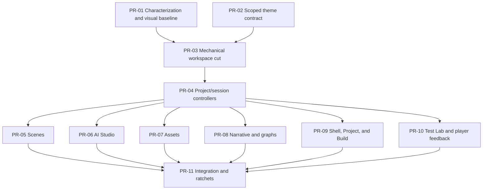

# Editor Modularization and Visual Convergence Roadmap

Status: in progress (characterization, theme contract, and bounded extraction waves implemented locally; PR split pending)
Base: `develop` at `6a1d2ec` (alpha.3 source preparation)
Date: 2026-07-14

## Current implementation checkpoint

- Characterization E2E and editor budget checks are active.
- `@pointclick/ui-theme` now exposes scoped `studio.css`, `player.css`, and
  `theme-contract.css` entry points; the player remains on the legacy palette.
- The editor stylesheet has an ordered entrypoint, a reset partial, and a
  semantic shell/theme partial. Topbar and project/build surfaces now consume
  the contract tokens.
- Pure editor lookup, asset, validation, selection, and provider-boundary
  helpers live in `apps/editor/src/editor-ui-model.ts`, covered by focused unit
  tests. Workspace stage-toolbar decisions now live in
  `apps/editor/src/editor-workspace-model.ts` with focused tests. The monolith
  is currently 14,399 lines; the legacy CSS is 5,286 lines with 650 literal
  color occurrences.
- Scene/document defaults, ID allocation, viewport guardrails, and layer
  validation now live in `apps/editor/src/editor-authoring-model.ts` with
  focused tests. The final provider-config breakpoint is isolated in
  `editor-responsive.css`, loaded after the base and theme layers.
- Scene, Asset Studio, AI Studio, Inspector, diagnostics, and status surfaces
  now consume the same semantic tokens through a late scoped feature layer;
  scene artwork remains intentionally warm and unchanged.
- Authoring mutations now pass through an injectable `EditorCommandBus` seam;
  project manifest hydration and overview draft reset now live in
  `apps/editor/src/editor-project-session.ts` with focused tests. Initial
  project/recovery loading and recovery persistence now use the same adapter;
  the remaining controller work will move reconciliation and status policy out
  of `EditorApp` without changing the public gateway contract.
- The full validation matrix is green locally: 48 Vitest files / 296 tests,
  13 Playwright tests, workspace typecheck, sample/starter validation, theme
  contract, documentation check, budget check, and the packaged editor build.

## Purpose

This roadmap turns the current editor into a modular, reviewable application and
brings its visual language closer to the supplied redesign mockups. It is an
engineering initiative inside the v0.4 line, not a new gameplay or project
schema milestone.

Mockup 4 is the primary color and semantic reference. Mockups 2 and 3 are the
reference for density, hierarchy, and legibility. The target is a compact
technical studio, not the surrounding marketing/dashboard composition shown in
the mockups.

## Baseline

| Area | Current evidence | Consequence |
|---|---:|---|
| `ui/editor-app.tsx` | 14,399 physical lines after bounded extraction; the `EditorApp` component remains the primary hotspot | Primary architecture and merge-conflict hotspot |
| React state in `EditorApp` | More than 120 local state declarations, 25 effects, and about 60 async handlers | Feature behavior has no practical ownership boundary |
| Gateway use | About 63 gateway calls, including 31 `applyCommand` calls | Persistence and UI reconciliation are repeated across features |
| `ui/editor.css` | 5,286 physical lines and 650 literal color occurrences | Cascade, color semantics, and feature ownership are unclear |
| Late CSS overrides | A second editor skin starts around line 3,658; selectors such as `.scene-viewport` are defined in multiple layers | Visual changes are difficult to predict and review |
| `ui/editor-shell.tsx` | 1,196 lines covering shell, Project, Build, Assets, and timeline UI | The extracted shell is itself becoming a second monolith |
| UI tests | Feature E2E specs exist, but `apps/editor/src/ui/**` is excluded from Vitest coverage | Refactoring depends on fragile end-to-end selectors and has no visual gate |
| Shared theme | `@pointclick/ui-theme/storyboard.css` is imported by both editor and player | A global palette replacement could unintentionally recolor the player |

The current clean baseline passes `pnpm test`, `pnpm typecheck`,
`pnpm validate:sample`, and `pnpm validate:starter`. Build, packaged smoke, and
the complete E2E suite remain mandatory PR/CI gates.

## Target outcomes

- `EditorApp` becomes a composition root and workspace router instead of a
  feature implementation.
- Project session, navigation, preview, and feature-local state have explicit
  controllers and pure selectors.
- Scene, Narrative, Assets, AI, Build, Project, and Test Lab own their markup,
  controller, styles, and focused tests.
- Presentation components do not call `EditorGateway` directly.
- Sibling features communicate through typed navigation and handoff contracts,
  not through imports of one another's internals.
- The editor uses one scoped, semantic dark-studio theme. The player changes
  only in its explicitly scheduled PR.
- Pull requests are small enough to review by behavior, with deterministic
  screenshots and a ratcheting file-size/color budget.

## Non-goals

- Project schema or gameplay contract changes.
- New AI providers or generation workflows.
- Replacing the existing navigation target or injectable gateway seams.
- Adopting a global state library before reducers, controllers, and context
  boundaries have been proven insufficient.
- Rebuilding the player layout or changing gameplay behavior.

## Visual direction

The visual direction is a nocturnal technical studio: cool deep-navy chrome
frames the warmer game artwork, violet identifies brand and primary selection,
and semantic colors retain one stable meaning across editor, graph, Test Lab,
and player feedback.

### Provisional semantic tokens

These values are the starting point for the theme-contract PR. They must pass
contrast checks before the token contract is frozen.

| Role | Token | Initial value |
|---|---|---:|
| Outer canvas | `--pc-bg-canvas` | `#070B14` |
| Application shell | `--pc-bg-app` | `#0A1020` |
| Panel | `--pc-bg-panel` | `#101827` |
| Raised panel | `--pc-bg-raised` | `#151F33` |
| Control/input | `--pc-bg-control` | `#0C1423` |
| Subtle border | `--pc-border-subtle` | `#1F2A44` |
| Strong border | `--pc-border-strong` | `#33415F` |
| Primary text | `--pc-text-primary` | `#F2F5FC` |
| Secondary text | `--pc-text-secondary` | `#AAB4C8` |
| Muted text | `--pc-text-muted` | `#71809C` |
| Brand/selection | `--pc-accent-brand` | `#7C4DFF` |
| Brand hover | `--pc-accent-brand-hover` | `#906BFF` |
| Information/tools | `--pc-state-info` | `#2F8CFF` |
| Path/success | `--pc-state-success` | `#35C76F` |
| Warning/inventory | `--pc-state-warning` | `#F0A51B` |
| Error/destructive | `--pc-state-danger` | `#F0525F` |
| Keyboard focus | `--pc-focus` | `#69A7FF` |

Semantic rules:

- Violet: brand, primary CTA, active workspace, and selected graph family.
- Blue: viewport tools, hotspots, information, and debug state.
- Green: walk paths, success, readiness, and graph start/end states.
- Amber: inventory, warnings, and breakpoints.
- Red: errors, destructive actions, and runtime divergence.
- Color never acts alone; icon, label, shape, or status text remains present.
- Main editor chrome uses the UI sans face. Mono is reserved for IDs, events,
  paths, and data. Editorial serif styling is not used for routine controls.
- Radii are uniform and compact; the current asymmetric panel radius is retired.

The theme package should expose separate editor and player entry points, for
example `studio.css` and `player.css`, while keeping compatibility aliases until
the player migration lands. This avoids changing the player as a side effect of
the editor token PR.

## Target module boundaries

```text
apps/editor/src/ui/
  app/
    EditorApp.tsx
    EditorProviders.tsx
    WorkspaceRouter.tsx
  core/
    project-session/
    navigation/
    preview/
    commands/
  shell/
    StudioTopbar.tsx
    WorkspaceFrame.tsx
    ProjectNavigator.tsx
    InspectorFrame.tsx
  shared/
    components/
    model/
    styles/
  features/
    project/
    scenes/
    narrative/
    assets/
    ai/
    build/
    test-lab/
```

Each feature should normally contain:

- a workspace/view component;
- a feature controller or reducer;
- pure selectors and model helpers;
- inspector and focused subcomponents;
- a feature stylesheet using semantic tokens only;
- focused unit and E2E tests.

`EditorNavigationTarget` remains the cross-workspace navigation contract.
`EditorGateway` remains injectable and is consumed by controllers or a project
command bus. The existing AI candidate/handoff types become an explicit shared
contract between AI, Scenes, and Assets.

## Pull request dependency graph



PR-01 and PR-02 can be developed in parallel. PR-03 and PR-04 are intentionally
serial and integrator-owned: they create the physical ownership boundaries that
make later parallel work safe. PR-05 through PR-10 are delivered in two waves
of three agents.

## PR plan

### PR-01 - Characterization and visual baseline

Branch: `codex/editor-characterization`
Owner: QA agent
Can run in parallel with: PR-02

Scope:

- Stabilize critical paths: workspace navigation, Scene tree/viewport
  selection, Build-to-source, Narrative-to-Scene, AI apply-to-Assets, and Test
  Lab enter/exit.
- Prefer role and accessible label locators; add `data-testid` only when no
  stable semantic locator exists.
- Capture deterministic screenshots for every workspace and Test Lab.
- Add a line/color budget script with the current values as a no-growth ratchet.
- Include pure UI model files in coverage while continuing to exclude rendered
  view code where appropriate.

Done when existing behavior is frozen without intentional visual changes.

### PR-02 - Scoped theme contract

Branch: `codex/editor-theme-contract`
Owner: visual-system agent
Can run in parallel with: PR-01

Scope:

- Add the semantic tokens listed above, including hover, selected, disabled,
  overlay, elevation, radius, and focus variants.
- Add editor/player theme entry points and backward-compatible aliases.
- Normalize button, input, select, tabs, badge, panel, tooltip, and focus
  primitives without broadly restyling workspaces.
- Initially map compatibility aliases to current values where needed so PR-03
  can remain visually neutral.

Done when token names and primitive state contracts are frozen and the player
has no accidental screenshot diff.

### PR-03 - Mechanical workspace and stylesheet cut

Branch: `codex/editor-modular-foundation`
Owner: integrator
Depends on: PR-01, PR-02

Scope:

- Move workspace JSX into feature directories without changing copy, markup
  semantics, or behavior.
- Split `editor-shell.tsx` by shell responsibility.
- Split the CSS into ordered base, shell, feature, dialog, and responsive
  files, preserving the existing cascade exactly.
- Add `WorkspaceRouter` and explicit typed props for each extracted workspace.
- Remove the late duplicate skin layer by relocating rules, not redesigning
  them in this PR.

Intermediate ratchet: `editor-app.tsx` below 9,000 physical lines, with no
visual snapshot changes beyond approved rendering noise.

### PR-04 - Project/session controllers and command bus

Branch: `codex/editor-session-controller`
Owner: integrator/core agent
Depends on: PR-03

Scope:

- Add `useProjectSessionController`, pure project selectors, recovery/autosave
  adapters, and a project command bus.
- Centralize gateway command execution, project reconciliation, draft cleanup,
  and user-visible error/status handling.
- Add feature-local reducers for Scenes, Assets, AI, and Preview/Build state.
- Keep navigation in the existing typed reducer and preserve the injectable
  gateway seam.

Done when presentation components contain no gateway calls and `EditorApp` is
below 1,500 lines of composition and cross-feature orchestration.

### Wave A - Three parallel feature PRs

All branches start from `develop` after PR-04 is merged.

| PR | Branch | Exclusive scope | Visual target |
|---|---|---|---|
| PR-05 Scenes | `codex/editor-scenes` | Scene tree, stage, viewport overlays, direct manipulation, toolbar, inspector, Scene CSS and E2E | Blue tools/hotspots, green walk path, violet selection, clear surface depth |
| PR-06 AI Studio | `codex/editor-ai` | Stepper, provider dialogs, target context, generation/review, handoff, AI CSS and E2E | Violet workflow, explicit state colors, consistent cards and controls |
| PR-07 Assets | `codex/editor-assets` | Browser, crop, chroma, optimize, guide, animation, Asset CSS and E2E | Neutral navy library surfaces, blue tools, no native light controls |

Each PR completes both controller cleanup and token-based visual migration for
its owned feature. No agent edits another feature or a shared-owned file.

### Wave B - Three parallel feature PRs

These can start after PR-04; scheduling them after Wave A keeps the active squad
to one coordinator plus three feature agents.

| PR | Branch | Exclusive scope | Visual target |
|---|---|---|---|
| PR-08 Narrative and graphs | `codex/editor-narrative` | Narrative tree, graph host, nodes/edges/minimap, locale/node inspector, diagnostics and E2E | Semantic node families; violet narrative, green flow endpoints, amber diagnostics |
| PR-09 Shell, Project, and Build | `codex/editor-shell-readiness` | Topbar, workspace tabs, sidebars, status strip, Project, Build, shared shell CSS and focused E2E | Mockup 2-3 density with mockup 4 navy/violet hierarchy |
| PR-10 Test Lab and player feedback | `codex/runtime-feedback-theme` | Test Lab header/tabs/logs/compare plus player HUD, verbs, inventory, dialogue and feedback styles | One runtime/debug language; gameplay and layout behavior unchanged |

### PR-11 - Integration, visual convergence, and final ratchets

Branch: `codex/editor-visual-convergence`
Owner: integrator with visual-system review
Depends on: PR-05 through PR-10

Scope:

- Tune only global tokens, density, elevation, border, focus, and responsive
  behavior that could not be finalized inside one feature.
- Remove compatibility re-exports, dead selectors, and superseded theme values.
- Approve the final screenshot set and document any intentional exceptions.
- Split `editor-session.ts` if it remains above the agreed budget after UI work.
- Lower the no-growth ratchets to the final budgets.

Final budgets:

- `EditorApp.tsx`: 300-500 lines, limited to providers, routing, and wiring.
- A feature component/controller: normally at most 500 lines; 800 is the hard
  ceiling and requires an explicit review note.
- A stylesheet: at most 800 lines.
- Literal colors outside theme files: fewer than 12 documented exceptions per
  application, limited to canvas/content-derived visualization colors.
- No sibling feature imports and no gateway calls in presentation components.

## Multi-agent operating model

Use one coordinator/integrator plus three concurrent worker agents.

| Role | Exclusive ownership |
|---|---|
| Integrator | `EditorApp`, core/session/state/gateway, router/barrels, root style imports, shared E2E fixture, config, package manifests, and lockfile |
| Feature agent | Its `features/<name>/**`, corresponding feature styles, and corresponding focused E2E spec |
| Visual-system agent | `packages/ui-theme/**` and shared primitive styles during PR-02; review-only afterward |
| QA agent | Screenshot harness, budget scripts, and cross-feature characterization tests during PR-01; review-only afterward |

Rules:

- One Git worktree and one `codex/...` branch per agent.
- Open every PR as draft; mark it ready only after its focused and repository
  gates pass.
- PRs target `develop`. Parallel feature branches start from the same merged
  foundation and are rebased on current `develop` before merge.
- Shared-owned files are never edited opportunistically by a feature agent. A
  required contract change becomes a small prerequisite PR owned by the
  integrator.
- `tests/e2e/editor-fixture.ts` is integrator-owned because all feature suites
  depend on it.
- Feature PRs do not modify contracts, manifests, or the lockfile. Necessary
  shared changes are isolated in a prerequisite PR.
- Generated assets, screenshots outside the approved baseline directory, build
  output, and project-specific files remain untracked.

## Quality gates

Every PR must run:

1. Focused unit tests for changed models/controllers.
2. `pnpm --filter @pointclick/editor typecheck`.
3. The focused Playwright spec for the owned feature.
4. Deterministic screenshots for the touched workspace.
5. `pnpm test` and `pnpm typecheck`.
6. `pnpm validate:sample` and `pnpm validate:starter`.
7. `pnpm check` before the PR is marked ready, as required by
   `CONTRIBUTING.md`.

PR-03, PR-04, and PR-11 additionally require the full editor E2E suite and a
build. PR-11 requires green Windows and Ubuntu CI, Windows package verification,
packaged Electron smoke, CodeQL, and dependency audit.

Visual baselines use fixed fixtures, DPR 1, disabled animation, and frozen
timestamps at these viewports:

- editor workspaces: `1440x900` and final manual review at `1536x1024` and
  `1920x1080`;
- collapsed editor: `1100x800`;
- Test Lab and player: `1440x900`;
- mobile player: `390x844`.

Recommended screenshot thresholds:

- chrome and primitives: `maxDiffPixelRatio <= 0.003`;
- deterministic scene/canvas: `<= 0.01`, or mask the canvas and compare editor
  overlays separately;
- isolated component states: `<= 0.001`.

Accessibility remains a release gate: normal text contrast at least 4.5:1,
large text and control boundaries at least 3:1, a visible focus indicator of at
least 2 px, keyboard-complete critical flows, and status meaning that does not
depend on color alone.

## Completion criteria

- The final architecture and line budgets are enforced by CI.
- Every workspace has an exclusive module, controller, stylesheet, and focused
  tests.
- Current project open/save, autosave/recovery, undo/redo, authoring, AI apply,
  validation, preview, Test Lab, and player flows remain green.
- Editor, graph, Test Lab, and player feedback share the approved semantic color
  system without losing contrast or focus visibility.
- All implementation reaches `develop` through reviewed pull requests; no
  parallel branch is integrated by copying files or bypassing PR review.
